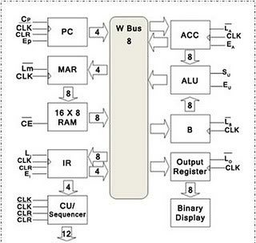

# 8-BitComputerFromScratch (status: On Pause)


Brought to you by: Alex Li and Yifan Zong (First-year CS and SE students at the University of Waterloo, Ontario, Canada)

## _Project Overview_ 
> Inspired by Ben Eater’s video series [“Build an 8-bit computer from scratch”](https://eater.net/8bit), we decided to make our own spinoff of Ben’s project using the provided video resources, kits and personal insights. 
> 
> Our reason for making this documentation is simple:  we want to inspire people to become curious about the fascinating digital world that we live in.
> 
>  Surely, when we decided to embark on this journey we expected certain failures and hardships but if there’s one thing that we can guarantee, it is that we surely had a blast while working on this project and certainly hope that you will too! Now, without further delay, let’s get to the project.

## _Timeline_ 
1. Start Date: Sunday May 2, 2021
2. Projected Duration: 2-3 months
3. Every Sunday for 2 - 6 hours
4. Completion Date: (On Pause) 

## _Architecture_
> As it is our first time building a computer from scratch, we have decided to follow the structure provided by Ben Eater: the [SAP-1 Architecture](https://study-for-exam.blogspot.com/2013/06/describe-sap-1-architecture.html).
> 
> ```* Note this is a very basic model of a computer that contains only the most essential parts to demonstrate the essential functionalities of a computer.```
> 
> Broadly speaking, we have a [**clock**](#1-Clock-Unit) unit, [**program counter**](#4-Program-Counter-Unit) unit, [**memory**](#3-Memory-Unit) unit, [**control**](#6-Control-Unit) unit, [**arithmetic**](#2-Arithmetic-Unit) unit, and [**output**](#5-Output-Unit) unit with a single shared **_bus_**.

Figure 1: SAP-1 basic architecture  block diagram



<hr>

## 1. _Clock Unit_
* 555 Timer
* Astable, Monostable, Bistable modes
* Build Help/ Our problems + Solutions

> The 555 Timer is a versatile IC with 8 pins that can be used in a variety of different applications. In our project, we implemented the 555 timer in 3 different ways: [**astable**](#1-Astable-Mode), [**monostable**](#2-Monostable-Mode), and [**bistable**](#3-Bistable-Mode) multivibrators.

### 1. _Astable Mode_
> An astable multivibrator, put simply, is an **oscillator** that oscillates between two digital states (0 - 1) at regular intervals producing a constant **square wave output**. This is the core component of the clock as it provides a constant pulse upon which all calculations are made.


As shown in the diagram above, the green portion contains a RC circuit (resistor-capacitor) with a 1kΩ resistor, 100kΩ resistor and 1μF timing capacitor. Initially, the voltage across the timing capacitor will be 0V, which is below both the trigger and threshold voltages. As such, reset(R) will be off and set(S) will be on, meaning that the output will be HIGH. 


As the capacitor charges, eventually, the voltage across it will be greater than 1.67 V. However, because the output has been latched, it remains HIGH. Finally, when the voltage across the capacitor surpasses 3.3V, the latch gets reset (output of LOW & reset(R) is on) and the discharge transistor will be toggled by not Q (Q with a bar over it).

Since electrical current always follows the path of least resistance, the capacitor will no longer be charged as the charging current will only pass through the 1kΩ resistor and be directed to ground through the discharge transistor.

Simultaneously, the capacitor will begin to discharge through the 100kΩ resistor to the discharge terminal (reset(R) is turned off) until its voltage goes below 1.67 V, which causes set(S) to be turned on (discharge transistor is turned off). Thus, completing one cycle. 

To get an approximate value for the clock’s frequency, we used the below calculations:


Sample Calculation for clock frequency:


> ``` Bonus: ``` for those who are curious about how the coefficient 0.693 is obtained, we will now demonstrate the relevant calculations. 
> 
>  The equations are fairly straight-forward and were taught in first year physics, so feel free to take a look if you’re interested.


